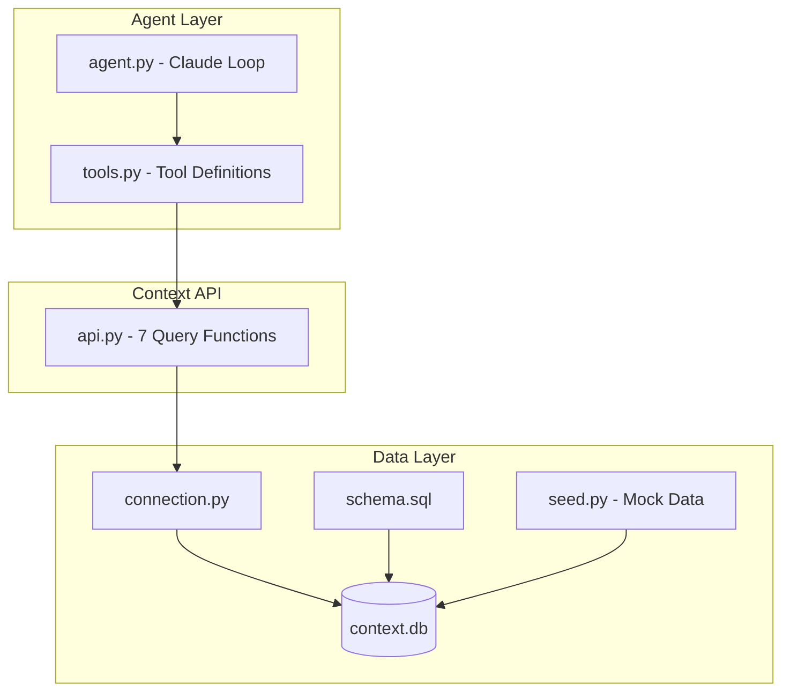

# Arcpoint Context Layer Implementation Plan

## Architecture Overview



---

## Phase 1: Project Structure (Commit 2)

Create the directory skeleton with empty stub files:

```
src/
├── __init__.py
├── db/
│   ├── __init__.py
│   ├── schema.sql        # Empty stub
│   ├── connection.py     # Empty stub  
│   └── seed.py           # Empty stub
├── context/
│   ├── __init__.py
│   └── api.py            # Empty stub
├── agent/
│   ├── __init__.py
│   ├── tools.py          # Empty stub
│   └── agent.py          # Empty stub
└── main.py               # Empty stub
tests/
└── test_demo.py          # Empty stub
data/                     # Directory for context.db
```

---

## Phase 2: Schema and Connection (Commit 3)

### `src/db/schema.sql`

Copy the SQL from `docs/SCHEMA.md` lines 256-323:

- 5 tables: `deployments`, `users`, `requests`, `incidents`, `quality_scores`
- All CHECK constraints for enums
- 8 indexes for query performance

### `src/db/connection.py`

Simple SQLite helper:

```python
def get_connection(db_path: str = "data/context.db") -> sqlite3.Connection
def init_db(db_path: str = "data/context.db") -> None  # Runs schema.sql
```

---

## Phase 3: Mock Data Generator (Commit 4)

### `src/db/seed.py`

Generate synthetic data that tells a story (from `CLAUDE.md` mock scenarios):

| Data | Volume | Key Scenarios |

|------|--------|---------------|

| Deployments | 6 | llama-70b/neocloud DOWN, gpt-4/k8s DEGRADED |

| Users | 10 | 3 premium, 4 standard, 3 budget |

| Requests | ~500 | 7 days, premium → gpt-4/aws, budget → llama-70b/k8s |

| Quality Scores | ~300 | 60% coverage, drops during incidents |

| Incidents | 2 | 1 active (llama-70b/neocloud), 1 resolved (gpt-4/k8s) |

Key implementation details:

- Use `uuid.uuid4()` for IDs with prefixes (`req_`, `user_`, `inc_`)
- Timestamps as RFC3339 UTC strings
- Realistic routing_reason JSON blobs
- Router version changes mid-week for debugging scenario

---

## Phase 4: Context API (Commit 5)

### `src/context/api.py`

Implement 7 tools from `docs/TOOLS.md`:

**Category A: Real-Time Health**

- `get_deployment_status(model_id?, backend_id?, status?)` - Query deployments table, compute `is_stale` from `updated_at`
- `get_active_incidents(target_type?, target_id?)` - Filter incidents where `status='active'`

**Category B: Debugging**

- `get_recent_requests(user_id?, user_tier?, deployment_id?, model_id?, backend_id?, status?, since?, until?, limit?)` - Join requests with users for tier
- `get_request_detail(request_id)` - Single request with parsed `routing_reason` JSON, quality score, related incident
- `get_user_context(user_id)` - User info + computed `daily_budget_used` from `SUM(requests.cost_usd)`

**Category C: Trends**

- `get_latency_trends(deployment_id?, model_id?, backend_id?, since?, until?, granularity?)` - Aggregate latency percentiles by time bucket
- `get_quality_summary(model_id?, task_type?, since?, until?)` - Aggregate quality scores by model/task
- `get_request_volume(group_by?, since?, until?, granularity?)` - Request counts grouped by tier/model/backend

**Time parsing helper:**

```python
def parse_time(time_str: str) -> str:
    # Handle "1 hour ago", "yesterday", "7 days ago", ISO strings
```

All functions return dicts matching the JSON schemas in TOOLS.md.

---

## Phase 5: Agent Tools and Loop (Commit 6)

### `src/agent/tools.py`

Define Claude tool schemas:

```python
TOOLS = [
    {
        "name": "get_deployment_status",
        "description": "Get current health status of deployments...",
        "input_schema": {...}
    },
    # ... 7 tools total
]

def execute_tool(name: str, args: dict) -> dict:
    """Dispatch to context API functions"""
```

### `src/agent/agent.py`

Claude function-calling loop:

```python
def run_agent(question: str) -> str:
    messages = [{"role": "user", "content": question}]
    
    while True:
        response = client.messages.create(
            model="claude-sonnet-4-20250514",
            tools=TOOLS,
            messages=messages,
            system=SYSTEM_PROMPT
        )
        
        if response.stop_reason == "end_turn":
            return extract_text(response)
        
        # Handle tool_use blocks
        for block in response.content:
            if block.type == "tool_use":
                result = execute_tool(block.name, block.input)
                messages.append(tool_result_message(block.id, result))
```

System prompt should instruct the agent to:

- Use tools to gather data before answering
- Format responses for human readability
- Correlate data across tools (e.g., link incidents to deployments)

---

## Phase 6: Demo Script (Commit 7)

### `src/main.py`

Interactive demo:

```python
def main():
    init_db()
    seed_data()
    
    print("Arcpoint Context Layer Demo")
    print("Example questions:")
    print("  - Which deployments are unhealthy?")
    print("  - Why are premium users slow?")
    
    while True:
        question = input("\n> ")
        if question.lower() in ("quit", "exit"):
            break
        response = run_agent(question)
        print(response)
```

---

## Phase 7: Tests and README (Commit 8)

### `tests/test_demo.py`

Test the 3 demo question categories:

```python
def test_health_questions():
    # "Which deployments are unhealthy?"
    # Assert returns llama-70b/neocloud (down) and gpt-4/k8s (degraded)

def test_debugging_questions():
    # "Why are premium users slow?"
    # Assert mentions gpt-4/aws routing

def test_trend_questions():
    # "Requests by tier this week?"
    # Assert returns counts for all 3 tiers
```

### `README.md`

- Project overview
- Setup instructions (venv, pip install, ANTHROPIC_API_KEY)
- How to run (`python src/main.py`)
- Example Q&A session
- Architecture summary

---

## Dependencies

Single dependency: `anthropic` (for Claude API)

```
# requirements.txt
anthropic>=0.39.0
```

---

## Risk Mitigation

| Risk | Mitigation |

|------|------------|

| Time parsing complexity | Start simple: support ISO + "N hours/days ago" only |

| Mock data realism | Generate data programmatically with controlled randomness |

| Agent hallucination | Strong system prompt + return structured data for agent to interpret |

| SQLite limitations | Fine for prototype; design API to be backend-agnostic |