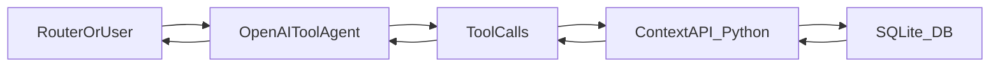

## Goal

Deliver a runnable prototype of the Context Layer that:

- Stores **current deployment state** + **historical requests** + **users** + **incidents** + **async quality scores** in SQLite (per [`docs/SCHEMA.md`](docs/SCHEMA.md)).
- Exposes a Python **Context API** that matches the agent tool contracts (per [`docs/TOOLS.md`](docs/TOOLS.md)).
- Includes a simple **OpenAI tool-calling agent loop** that can answer the demo questions from [`CLAUDE.md`](CLAUDE.md).

## What we will build (repo shape)

Create the V1 structure already specified in [`CLAUDE.md`](CLAUDE.md):

- [`src/db/schema.sql`](src/db/schema.sql): SQLite DDL + indexes from `docs/SCHEMA.md`.
- [`src/db/connection.py`](src/db/connection.py): connection helper + lightweight query helpers.
- [`src/db/seed.py`](src/db/seed.py): deterministic mock data generator implementing the scenarios in `CLAUDE.md`.
- [`src/context/api.py`](src/context/api.py): Context query functions (tools) returning dicts/lists.\n+- [`src/context/sql_tools.py`](src/context/sql_tools.py): safe SQL generation + execution helpers (read-only).\n+- [`src/agent/tools.py`](src/agent/tools.py): OpenAI tool definitions JSON schema mirroring `docs/TOOLS.md` (+ SQL tool).\n+- [`src/agent/llm_client.py`](src/agent/llm_client.py): thin OpenAI client wrapper (provider boundary; future LangChain/LangGraph ready).\n+- [`src/agent/agent.py`](src/agent/agent.py): agent loop that calls tools via a tool registry and formats answers.
- [`src/main.py`](src/main.py): demo entrypoint.
- [`tests/test_demo.py`](tests/test_demo.py): minimal tests covering core tool behaviors.
- [`data/context.db`](data/context.db): generated by `seed.py` (ensure it’s generated, not hand-edited).

## Data flow & runtime (high level)

## Implementation plan (milestones)

### Milestone 0: Bootstrap & conventions

- Add a minimal dependency spec (e.g., `requirements.txt`) for Python 3.11+ with at least `openai`.
- Define configuration conventions:
  - `CONTEXT_DB_PATH` (default `data/context.db`)
  - `OPENAI_API_KEY` for the agent demo
  - `OPENAI_MODEL` (optional; default to a tool-capable model)
- Add small shared utilities (date parsing, RFC3339 UTC helpers) to keep tool functions clean.

### Milestone 1: SQLite schema (source of truth: `docs/SCHEMA.md`)

- Implement [`src/db/schema.sql`](src/db/schema.sql) exactly matching:
  - 5 tables (`deployments`, `requests`, `users`, `incidents`, `quality_scores`)
  - constraints/checks
  - indexes
- Add a simple initializer in [`src/db/connection.py`](src/db/connection.py) to create tables if missing.

### Milestone 2: Seed data generator (tell the story)

- Implement [`src/db/seed.py`](src/db/seed.py) to generate:
  - 6 deployments
  - 10 users split across tiers
  - ~500 requests over 7 days, with router version changes + one experiment
  - ~300 quality scores (~60% coverage)
  - 2 incidents (1 active, 1 resolved), aligned with the scenarios in `CLAUDE.md`
- Make it deterministic (seeded RNG) so tests and demos are stable.

### Milestone 3: Context API (source of truth: `docs/TOOLS.md`)

Implement the tool functions in [`src/context/api.py`](src/context/api.py) with:

- **Consistent return shapes** exactly as in `docs/TOOLS.md`
- **Consistent error envelope** (`error`, `message`, `code`) per `docs/TOOLS.md`
- **Time parsing**: accept ISO strings or relative strings ("1 hour ago", "yesterday")
- **Staleness calculation** for deployments:
  - mark `is_stale` if `updated_at` is too old or `sample_count` too low (per `docs/SCHEMA.md` notes)

Tools to implement:

- `get_deployment_status(model_id=None, backend_id=None, status=None)`
- `get_active_incidents(target_type=None, target_id=None)`
- `get_recent_requests(user_id=None, user_tier=None, deployment_id=None, model_id=None, backend_id=None, status=None, since=None, until=None, limit=50)`
- `get_request_detail(request_id)` (join request + quality + related incident where applicable)
- `get_user_context(user_id)` (derive daily budget used/remaining from `requests.cost_usd`)
- `get_latency_trends(deployment_id=None, model_id=None, backend_id=None, since="24 hours ago", until="now", granularity="hour")`
- `get_quality_summary(model_id=None, task_type=None, since="7 days ago", until="now")`
- `get_request_volume(group_by="tier", since="7 days ago", until="now", granularity="day")`

Add one additional tool for ad-hoc analysis:\n+- `generate_sql(query, safety_level="read_only")`\n+  - **Purpose**: convert a user question into a SQL `SELECT` query against the schema in `docs/SCHEMA.md`.\n+  - **Returns**: `{ \"sql\": \"...\", \"params\": [...], \"tables\": [...], \"notes\": \"...\" }`.\n+  - **Safety constraints** (enforced in Python before execution):\n+    - allow **SELECT-only** (no INSERT/UPDATE/DELETE/ALTER/DROP/PRAGMA)\n+    - restrict to known tables (`deployments`, `requests`, `users`, `incidents`, `quality_scores`)\n+    - enforce a default `LIMIT` if the query omits one\n+  - **Execution**: pair this with a tiny helper (e.g., `run_sql(sql, params)` in `src/context/sql_tools.py`) that validates and executes the query, returning rows as dicts.\n+  - **Reason**: this gives the agent a generic escape hatch beyond the fixed tool set, and mirrors how LangChain/LangGraph SQL agents typically work later.

### Milestone 4: OpenAI tool wiring + agent loop (real API)

- Implement [`src/agent/tools.py`](src/agent/tools.py) to define the tools array that OpenAI expects; keep it mechanically aligned to `docs/TOOLS.md` (+ `generate_sql`).
- Implement [`src/agent/agent.py`](src/agent/agent.py):
  - Calls OpenAI with tool definitions
  - Executes tool calls via a small **ToolRegistry** (name → callable + schema) instead of hard-coding (makes future LangChain/LangGraph migration easy)
  - Formats structured tool outputs into concise human-readable answers
  - Handles tool errors gracefully (surface `message`, include `code`)

Agent extensibility boundary:\n+- Keep LLM calls behind [`src/agent/llm_client.py`](src/agent/llm_client.py) so swapping providers/frameworks later is localized.\n+- Keep tool execution behind a registry so a future LangGraph-style state machine can reuse the same tools without refactors.

### Milestone 5: Demo entrypoint

- Implement [`src/main.py`](src/main.py) to:
  - Ensure DB exists (run schema init if needed)
  - Prompt user for a question (or run a small scripted list of demo questions)
  - Run agent loop and print results

### Milestone 6: Minimal tests

- Add [`tests/test_demo.py`](tests/test_demo.py) to validate:
  - Seed determinism (counts / key scenario invariants)
  - Tool return shapes + error handling
  - Staleness logic for deployments
  - A couple representative trend aggregations (latency + volume)

## Acceptance criteria (what “done” means)

- Running `python src/db/seed.py` creates/overwrites `data/context.db` with coherent mock data.
- Running `python src/main.py` with `OPENAI_API_KEY` lets the agent answer the demo questions from `CLAUDE.md` by calling tools (including optionally generating and running read-only SQL for ad-hoc questions).
- All tool functions match `docs/TOOLS.md` return shapes and error format.
- Tests pass locally.

## Risks / gotchas to handle explicitly

- SQLite time handling: store RFC3339 UTC strings consistently; parse to timestamps in Python for relative-time filters.
- Trend queries: implement grouping carefully (hour/day) and ensure empty windows behave sensibly.
- Deterministic seeding: use one RNG seed and avoid `datetime.now()` in generated historical data (derive from a fixed base time).