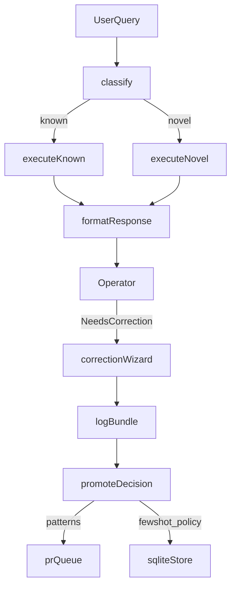

## Goals
- Build an operator-facing agent that is **read-only**, deterministic on known patterns, and explicit about uncertainty on novel queries.
- Add a **web UI** for “Needs correction” that captures an evidence bundle and runs a guided correction wizard.
- Use **hybrid learning storage**:
  - patterns/tool sequences in code (versioned)
  - few-shot examples + policy rules in SQLite (reviewable/retireable, exportable snapshots)

## Architecture decisions (locked)
- **LangGraph** orchestration with nodes:
  - `classify` (Gemini Flash) → `execute_known` or `execute_novel` → `format_response`
  - known patterns use pre-defined tool sequences (no LLM planning)
  - novel queries run critical checks + LLM planner + uncertainty banner
- **Tools-first**:
  - domain tools from `docs/TOOLS.md`
  - `safe_sql_query` fallback with guardrails (SELECT-only, LIMIT<=100, timeout, audit)
- **No RAG, no autonomous memory**:
  - schema/tool contracts included via a generated system prompt builder
  - learning is via HITL correction + promotion

## Correction workflow (web UI)
- Every agent response persists an **evidence bundle**:
  - query, classifier output, tool calls+args, tool outputs (or hashes+excerpts), final answer, model versions, cache hits
- Operator clicks **Needs correction** → wizard asks “what kind of wrong?”
  - misclassified
  - wrong tool sequence/defaults
  - wrong synthesis
  - tool/data bug
  - one-off
- Wizard collects the minimal correction payload and ends with **promotion target(s)**:
  - update patterns/tool sequences (code)
  - add few-shot example (SQLite)
  - add policy rule (SQLite)
- Add an **export snapshot** action to dump active few-shots/policy to a file for diff/rollback.

## Data model additions (SQLite)
- New tables (suggested):
  - `agent_runs` (one row per question/answer)
  - `tool_calls` (normalized tool calls per run)
  - `corrections` (operator feedback + classification of error)
  - `promoted_rules` (policy rules: draft/active/retired)
  - `few_shot_examples` (draft/active/retired)
  - `sql_audit_log` (for `safe_sql_query`)

## Implementation steps (files)
- Agent
  - `src/agent/graph.py`: LangGraph definition + known/novel branching
  - `src/agent/classifier.py`: Gemini Flash classifier wrapper
  - `src/agent/patterns.py`: `QueryPattern` enum + tool sequences
  - `src/agent/tools.py`: tool wrappers around `src/context/api.py` and `safe_sql_query`
  - `src/agent/prompts.py`: deterministic system prompt builder (schema + tool contracts + active policies + active few-shots)
  - `src/agent/cache.py`: TTL cache keyed by tool+args+time bucket
  - `src/agent/formatter.py`: response formatting + anomaly surfacing + NOVEL banner
- Context tools
  - `src/context/api.py`: domain tool implementations matching `docs/TOOLS.md`
  - `src/context/sql_tools.py`: SELECT-only validator/executor + row limit + timeout + audit
- Corrections subsystem
  - `src/corrections/store.py`: persist evidence bundles + correction records
  - `src/corrections/review.py`: apply DB promotions; queue code changes for patterns
  - `src/corrections/export.py`: export snapshot of active few-shots/policy
- Web app
  - `src/web/app.py`: FastAPI endpoints
  - `src/web/templates/` (or a minimal frontend): runs list, run detail, “Needs correction” wizard

## Guardrails and tests
- Enforce read-only:
  - `safe_sql_query` rejects non-SELECT and multiple statements
  - domain tools do not mutate DB
- Tests:
  - tool return-shape tests vs `docs/TOOLS.md`
  - SQL guardrail tests
  - classifier routing tests (including “fallback to NOVEL if known-pattern results are empty/ambiguous”)
  - correction logging tests

## Definition of done
- Operator can:
  - ask questions → see tool evidence in UI
  - click Needs correction → complete wizard
  - promote to policy/few-shot immediately (DB)
  - queue pattern updates for code review
  - export snapshot of active policies/few-shots
