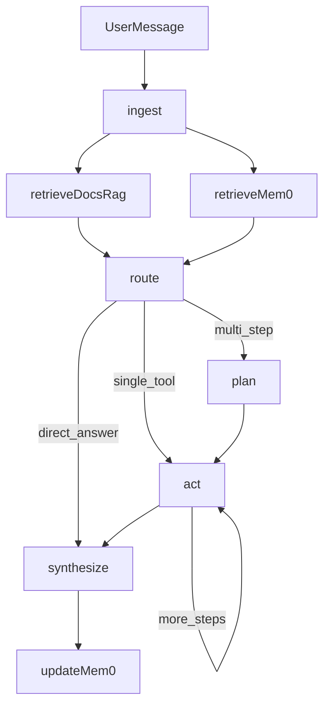

## What you already have (important constraints)
- Your repo already defines **domain-level tool contracts** in [`/Users/zhaosongyan/Desktop/Agentic_router/docs/TOOLS.md`](/Users/zhaosongyan/Desktop/Agentic_router/docs/TOOLS.md) (e.g. `get_deployment_status`, `get_request_detail`, trends).
- Your source-of-truth operational data is **SQLite** (see [`/Users/zhaosongyan/Desktop/Agentic_router/docs/SCHEMA.md`](/Users/zhaosongyan/Desktop/Agentic_router/docs/SCHEMA.md) and [`/Users/zhaosongyan/Desktop/Agentic_router/src/db/schema.sql`](/Users/zhaosongyan/Desktop/Agentic_router/src/db/schema.sql)).
- You confirmed: **agent should be read-only**, and **cloud services are acceptable**.

## Recommendation (design choices)
- **LangGraph over “just LangChain AgentExecutor”**: you’re explicitly asking about “a node to decide whether to plan” and multi-step flows; LangGraph makes that explicit, testable, and traceable.
- **Tools: prefer many domain tools + (optional) one safe SQL tool**
  - Keep the domain tools from `docs/TOOLS.md` as first-class tools because they:
    - encode business logic (e.g., staleness flags, joins, derived fields)
    - reduce SQL prompt injection surface
    - give stable, typed interfaces for evaluation
  - Add an optional **`safe_sql_query`** tool for exploration/debugging when the domain tools don’t cover a question. Because you’re read-only, restrict to `SELECT` only and optionally an allowlist of tables/columns.
- **Memory: use a hybrid**
  - **RAG**: for *static* knowledge (schema/design/tool docs) so the agent reliably knows the contracts and schema.
  - **mem0**: for *updatable* long-term “learnings” and preferences (e.g., “when asked about latency spikes, always check incidents + tier segmentation first”, or user/operator preferences for reporting). 
  - Hard rule: **do not store dynamic truth (current health, counts) in memory**; those must come from SQLite tools.

## Proposed LangGraph architecture
- Nodes:
  - `ingest`: normalize user message, detect time ranges (“yesterday”, “last 2h”).
  - `retrieve_docs_rag`: fetch relevant snippets from DESIGN/SCHEMA/TOOLS docs.
  - `retrieve_mem0`: fetch relevant long-term learnings/preferences.
  - `route`: classify into `direct_answer` vs `single_tool` vs `multi_step`.
  - `plan`: only for `multi_step` (generate a short tool plan + success criteria).
  - `act`: tool execution loop (1 tool call at a time).
  - `synthesize`: produce final answer + cite evidence from tool outputs.
  - `update_mem0`: store only durable learnings (not ephemeral metrics) and only when confidence is high.

- Gating logic (your “do we need a planning node?” question):
  - Always do cheap retrieval (`retrieve_docs_rag`, `retrieve_mem0`).
  - Then `route` decides:
    - **No plan** if the question maps to exactly one tool call (e.g. “any active incidents?”).
    - **Plan** if it needs multiple tool calls, comparisons, or hypothesis testing (e.g. “why are premium users slow?” typically needs incidents + latency trends + recent requests).

## Tooling design (what tools you expose)
- Primary (domain) tools mirroring `docs/TOOLS.md`:
  - `get_deployment_status`, `get_active_incidents`, `get_recent_requests`, `get_request_detail`, `get_user_context`, `get_latency_trends`, `get_quality_summary`, `get_request_volume`.
- Optional helper tools:
  - `get_schema_snapshot` (wrap [`src/db/inspect.py`](/Users/zhaosongyan/Desktop/Agentic_router/src/db/inspect.py) so the agent can confirm table/column names).
  - `safe_sql_query(query: str)` (SELECT-only, allowlisted, with row limit, timeout, and explicit error codes).

## Implementation outline (files to add/modify)
- Dependencies
  - Add LangChain/LangGraph + provider bindings + LangSmith + mem0 client.
- Context-layer API (if not already present in `src/`)
  - Add/complete [`/Users/zhaosongyan/Desktop/Agentic_router/src/context/api.py`](/Users/zhaosongyan/Desktop/Agentic_router/src/context/api.py) implementing the contracts in `docs/TOOLS.md`.
  - Add `src/context/sql_tools.py` for SELECT-only validation and execution.
- Agent package
  - Add `src/agent/graph.py`: LangGraph definition + routing/planning nodes.
  - Add `src/agent/tools.py`: LangChain `@tool` wrappers around `src/context/api.py`.
  - Add `src/agent/memory.py`: mem0 read/write policy + “what is allowed to persist”.
  - Add `src/agent/prompts.py`: system + planner prompts that enforce read-only and tool-first behavior.
- Entrypoint
  - Update/add `src/main.py` to run the LangGraph agent, with LangSmith tracing enabled.

## Evaluation / safety checks
- Add tests for:
  - Tool schema compliance (return shapes match `docs/TOOLS.md`).
  - SQL safety (reject non-SELECT, reject multiple statements, enforce LIMIT).
  - Routing correctness (single-tool questions should not go through planning node).
- Add “read-only guarantee” assertion in tool layer (no write statements, no write API calls).

## What this enables
- Expansion: add a new tool by adding one function in `src/context/api.py` + one wrapper in `src/agent/tools.py`.
- Tracking: LangSmith traces show which retrieval/tool calls drove the answer.
- Updating knowledge: mem0 stores durable heuristics and user preferences without polluting truth data.
