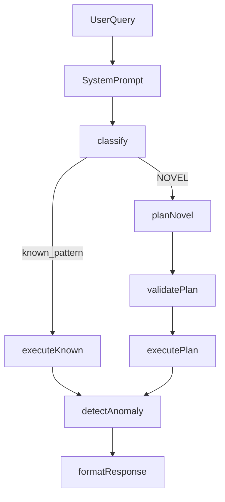

## V1 scope (what we will build now)

- **Read-only** agent answering operator questions against SQLite context DB.
- **LangGraph** orchestration with explicit nodes:
  - `classify` (Gemini Flash) → `execute_known` or `execute_novel` → `format_response`
- **Known patterns** run **pre-defined tool sequences** (no LLM planning).
- **NOVEL** uses **plan → validate → execute**:
  - `plan_novel`: propose a tool plan + uncertainties
  - `validate_plan`: enforce guardrails and required checks when ops-like
  - `execute_plan`: run the validated plan (with caching/limits)
- **Tools**: domain tools (per `docs/TOOLS.md`) + `safe_sql_query` (SELECT-only, LIMIT<=100, timeout, audit).
- **No HITL**: no correction logging UI, no promotion pipeline.

## Files to use/align with

- Tool contracts: [`/Users/zhaosongyan/Desktop/Agentic_router/docs/TOOLS.md`](/Users/zhaosongyan/Desktop/Agentic_router/docs/TOOLS.md)
- Schema semantics: [`/Users/zhaosongyan/Desktop/Agentic_router/docs/SCHEMA.md`](/Users/zhaosongyan/Desktop/Agentic_router/docs/SCHEMA.md) and [`/Users/zhaosongyan/Desktop/Agentic_router/src/db/schema.sql`](/Users/zhaosongyan/Desktop/Agentic_router/src/db/schema.sql)

## LangGraph flow (v1)

## Node responsibilities

- **`systemPrompt`**: deterministic prompt builder containing:
  - tool contracts summary (names + params + return shape expectations)
  - schema summary (tables + key columns)
  - guardrails (read-only; domain tools first; SQL only if needed)
- **`classify`**: Gemini Flash returns `QueryPattern` or `NOVEL`.
- **`execute_known`**:
  - map pattern → tool sequence (with caching per tool TTL)
  - extract parameters (time windows, model/backend/user/request_id) via a lightweight argument-extractor step (LLM or deterministic parsing)
  - run tools; if results empty/ambiguous, escalate to the NOVEL path (`plan_novel`)
- **`plan_novel`**:
  - produces a structured plan (JSON) with:
    - `query_intent`: `ops_investigation | request_lookup | user_lookup | traffic | schema_docs | other`
    - `steps`: ordered list of `{tool_name, args, purpose}`
    - `uncertainties`: what the planner is unsure about
    - `verification_tips`: optional suggestions for the operator
- **`validate_plan`** (deterministic, correctness-first):
  - enforce max steps/time budget and tool allowlist
  - enforce SQL restrictions (`safe_sql_query` must be SELECT-only, LIMIT<=100, timeout)
  - require early critical checks **when ops-like** (see heuristic below)
- **`execute_plan`**:
  - execute tools sequentially with max steps/timeout
  - allow one adaptive re-plan only if a step fails/returns empty results (otherwise stop)
- **`detect_anomaly`**:
  - apply conservative anomaly heuristics (avoid false negatives)
  - never say “all clear” unless incidents+health checks ran
- **`format_response`**:
  - concise answer + alerts + “tools used” list
  - if NOVEL: add uncertainty banner + verification suggestions

## Ops-like heuristic (v1, deterministic)

Used by `validate_plan` to avoid missing incidents/health checks on NOVEL queries.

- Treat as ops-like if either:
  - `query_intent == ops_investigation`, OR
  - the raw query matches any signal below (case-insensitive substring match).
- If ops-like, require `get_active_incidents` and `get_deployment_status` to appear within the first 2–3 plan steps (order flexible).

Signals:

- **Keyword signals**: `incident`, `outage`, `down`, `degraded`, `health`, `status`, `unhealthy`, `latency`, `slow`, `p95`, `p50`, `timeout`, `ttft`, `tail`, `error`, `error rate`, `5xx`, `rate limit`, `throttle`, `spike`, `regression`, `elevated`, `anomaly`
- **Time-window signals**: `now`, `today`, `yesterday`, `last`, `past`, `since`, `over the`, `in the last`

## Query patterns (v1 initial set)

- `SYSTEM_STATUS`: `get_active_incidents → get_deployment_status`
- `ACTIVE_INCIDENTS`: `get_active_incidents`
- `LATENCY_INVESTIGATION`: `get_active_incidents → get_latency_trends → get_deployment_status → get_recent_requests`
- `QUALITY_INVESTIGATION`: `get_active_incidents → get_quality_summary → get_deployment_status → get_request_detail`
- `ERROR_INVESTIGATION`: `get_active_incidents → get_deployment_status → get_recent_requests → get_request_detail`
- `TRAFFIC_ANALYSIS`: `get_request_volume → get_latency_trends`
- `REQUEST_LOOKUP`: `get_request_detail`
- `USER_LOOKUP`: `get_user_context → get_recent_requests`
- `NOVEL`: planner path

## Tools (v1)

- Domain tools implemented in `src/context/api.py` matching `docs/TOOLS.md`.
- `safe_sql_query(query: str)` implemented in `src/context/sql_tools.py`:
  - reject non-SELECT + multiple statements
  - enforce `LIMIT 100`
  - timeout (5s)
  - audit log (structured event log to stdout or a SQLite table if you prefer)

## Caching

- Tool-level caching with TTLs (as in your draft):
  - incidents 30s, deployment status 10s, trends 60s, recent requests 30s, request detail 300s
- Cache key = tool name + normalized args + time bucket (for relative windows)

## Testing (v1)

- Unit tests:
  - tool return shapes align with `docs/TOOLS.md`
  - `safe_sql_query` guardrails
  - classifier routing + “escalate to NOVEL if empty/ambiguous”
  - one end-to-end “latency investigation” scenario from seeded DB

## Definition of done (v1)

- `python src/main.py` runs an interactive loop.
- Known-pattern questions execute fast (no planner), produce consistent tool usage.
- NOVEL questions show an uncertainty banner; ops-like NOVEL questions are forced (by validator) to include incidents+health checks early.
- SQL tool is demonstrably read-only and guarded.